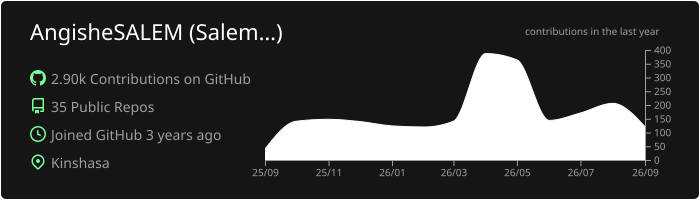

  

---

###  À propos de moi

Fort d'une expérience concrète dans la conception et le déploiement de solutions performantes pour diverses organisations, j'allie le développement d'applications modernes à la puissance de l'IA Générative pour concevoir des produits robustes, intelligentes et sur mesure.

*  **Expertise technique :**
  * **Frontend & Mobile :** Next.js, React, Flutter
  * **Backend & APIs :** FastAPI, Django, Node.js
  * **GenAI & NLP :** LLMs, RAG, Prompt Engineering
*  **Passion :** Audiophile et perfectionniste dans chaque ligne de code.

  

---

###  Ma Stack Technique

<table width="100%" align="center">
  <tr>
    <td width="50%" valign="top">
      <h4 style="font-family: Calibri, sans-serif;">
         Développement Web & Mobile
      </h4>
      
      
      
      
      
      
      
      
    </td>
    <td width="50%" valign="top">
      <h4 style="font-family: Calibri, sans-serif;">
         GenAI, IA & Cloud
      </h4>
      
      
      
      
    </td>
  </tr>
</table>

  
  
  

---

###  Contact & Support

  

 
 

